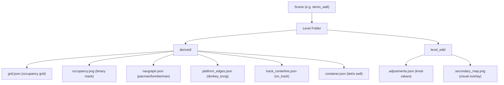

# QA Checklist: Template Cartridges × Custom Levels

These 10 cartridges are the foundation for everything else. If their custom-map pipelines are solid, every future game inherits that reliability.

---

## How The Pipeline Works (Quick Reference)

Every cartridge reads `derived/` for map structure and writes to `level_edit/` for per-game tuning.

---

## Universal Checks (Apply to ALL cartridges)

Run each game on **at least 2 custom levels** (e.g. `rock_wall`, `gallery`, `car`) plus its classic level.

| # | Check | What to watch for |
|---|-------|-------------------|
| U1 | **Boots without crash** | No grey screen. Game renders immediately. |
| U2 | **Grid loads correctly** | Game area fills the mapped play region, not the whole window. |
| U3 | **Reference image shows** | Open Settings → toggle "Reference" ON. Photo should overlay behind gameplay. |
| U4 | **Reference opacity slider works** | Drag it — image should fade in/out smoothly. |
| U5 | **Settings persist** | Change a knob, exit, re-launch same game on same level. Value should restore. |
| U6 | **Settings are per-level** | Change a knob on level A, switch to level B — values should be independent. |
| U7 | **Tab/Start opens settings overlay** | Both keyboard Tab and controller Start should toggle the settings panel. |
| U8 | **Controller plays the game** | D-pad / left stick moves, A/B buttons work. |
| U9 | **Fallback grid works** | If `derived/` folder is empty or missing, game should still boot with a default grid. |

---

## Per-Cartridge Deep Checks

### 🟡 Pacman
**Unique data:** Builds its own navgraph from `grid.json` — does NOT read `navgraph.json`.

| # | Check | Details |
|---|-------|---------|
| P1 | **Navgraph auto-generates** | On a custom map, dots/paths should fill walkable cells only. No dots in walls. |
| P2 | **Ghost AI navigates** | Ghosts follow paths without getting stuck in geometry. |
| P3 | **Power pellets work** | Large dots turn ghosts blue; eating them scores chain bonus. |
| P4 | **Pickup collision scales** | On maps with larger cells, pickup radius should grow (your `grid_cell_size * 0.45` fix). |
| P5 | **Tunnel wrapping** | If the map has open edges, pacman should wrap. If walled, no wrapping. |
| P6 | **Win condition fires** | Eat all dots → wave complete → dots repopulate. |
| P7 | **Secondary editor knobs** | `show_debug_grid`, `grid_resolution`, `invert_grid` should visually affect the maze shape. |

---

### 🟡 Asteroids
**Unique data:** `grid.json` → collision walls. Writes `secondary_map.png`.

| # | Check | Details |
|---|-------|---------|
| A1 | **Collision follows walls** | Ship bounces off dark (blocked) cells. Bullets stopped by walls. |
| A2 | **Ship wraps at edges** | Classic wrap-around at stage boundaries. |
| A3 | **Bullets wrap too** | Shots should teleport through edges (your recent fix). |
| A4 | **Ship scale knob** | `ship_scale` slider should resize the ship visually and change its hitbox. |
| A5 | **Secondary map generates** | Check `level_edit/<cart>.secondary_map.png` appears after first boot. |
| A6 | **Collision mode toggle** | Settings → `collision_mode` between "grid" / "organic". Both should change wall shapes. |
| A7 | **Background view toggle** | "collision" / "reference" / "off" should swap what's behind gameplay. |
| A8 | **Invert grid** | Toggling should swap walkable ↔ blocked regions. |
| A9 | **Rotation controls** | Left stick / D-pad left-right rotates, up is thrust (your recent fix). |

---

### 🟡 Tetris
**Unique data:** `container.json` (well polygon + spawn lip + down direction).

| # | Check | Details |
|---|-------|---------|
| T1 | **Well shape matches** | Pieces should fall within the `well_polygon` shape, not a rectangle. |
| T2 | **Down direction correct** | If the wall is tilted, "down" should follow the `down_direction` vector. |
| T3 | **Spawn lip correct** | Pieces should appear at the `spawn_lip` position. |
| T4 | **Line clears work** | Completing a row inside the well should clear it. |
| T5 | **Pieces don't clip** | On irregular wells, pieces should snap to valid positions only. |
| T6 | **Grid overlay** | Debug grid should visualize the well's internal cell grid. |

---

### 🟡 Frogger
**Unique data:** Uses `occupancy.png` for lane detection via LaneAdapter.

| # | Check | Details |
|---|-------|---------|
| F1 | **Lanes auto-detect** | Cars/logs should follow horizontal bands derived from the map. |
| F2 | **Lane speed varies** | Different lanes should have different vehicle speeds. |
| F3 | **Safe zones exist** | Frog should be able to stand on walkable cells without dying. |
| F4 | **Goal row works** | Top lane(s) should register as the win zone. |
| F5 | **Lane expand/invert knobs** | Adjusting `lane_expand_px` / `invert_lanes` should reshape the lane layout. |

---

### 🟡 Donkey Kong
**Unique data:** `platform_edges.json` + `occupancy.png` for platform detection. Has multi-game modes (barrel, breakout, bubble, etc.).

| # | Check | Details |
|---|-------|---------|
| D1 | **Platform placement** | Girders should follow the map's physical structure. Player walks on them. |
| D2 | **Ladders generate** | Vertical connections between platforms should appear at reasonable positions. |
| D3 | **Barrel mode works** | Barrels roll down platforms, DK throws from top. |
| D4 | **All sub-modes boot** | Barrel, Breakout, Bubble, Drill, Dungeon, Marble, Joust, Snake, Tapper, Tempest — each should load. |
| D5 | **Player spawns on platform** | Not in mid-air or inside a wall. |

> [!WARNING]
> Donkey Kong has the most sub-game-modes of any cartridge. The `_tick_barrel` crash at line 1089 (`items[0]` on empty array) may resurface if a custom map doesn't set up the barrel goal item correctly.

---

### 🟡 Galaga
**Unique data:** `grid.json` + `occupancy.png`. Space shooter — grid defines play region.

| # | Check | Details |
|---|-------|---------|
| G1 | **Play region scales** | Enemies and player stay within the mapped area. |
| G2 | **Enemy formations fit** | Wave patterns should scale to the available play area. |
| G3 | **Ship doesn't leave bounds** | Player movement clamped to play region edges. |

---

### 🟡 GTA
**Unique data:** `grid.json` + `occupancy.png`. Top-down open-world driving.

| # | Check | Details |
|---|-------|---------|
| G1 | **Roads follow walkable** | Car should drive on open cells, be blocked by walls. |
| G2 | **NPC spawning** | Characters should spawn in walkable areas, not inside geometry. |
| G3 | **Camera follows** | View should scroll with the player on large maps. |

---

### 🟡 On Track (Racing)
**Unique data:** `track_centerline.json` (checkpoints).

| # | Check | Details |
|---|-------|---------|
| O1 | **Track follows centerline** | Car should drive along the detected track path. |
| O2 | **Checkpoints register** | Passing through checkpoint markers should update lap progress. |
| O3 | **Lap detection** | Completing the circuit should count as a lap. |
| O4 | **Off-track slowdown** | Driving onto blocked cells should slow the car. |

> [!IMPORTANT]
> `track_centerline.json` is often empty (`"checkpoints": []`) on levels that weren't authored for racing. On Track should fallback gracefully and either auto-generate checkpoints from the occupancy grid, or show a "no track data" warning.

---

### 🟡 Paperboy
**Unique data:** Uses LaneAdapter (like Frogger) via SharedLoader.

| # | Check | Details |
|---|-------|---------|
| PB1 | **Lane layout loads** | Horizontal lanes should align with the map's visual structure. |
| PB2 | **Scrolling direction** | Paperboy scrolls along lanes — verify direction matches the map. |
| PB3 | **Obstacle placement** | Obstacles should appear on lane boundaries, not in open space. |

---

### 🟡 Rampage
**Unique data:** `grid.json` + `occupancy.png`. Building destruction.

| # | Check | Details |
|---|-------|---------|
| R1 | **Buildings map to geometry** | Destructible blocks should align with dark (occupied) cells. |
| R2 | **Monster fits** | Player monster should scale appropriately to the grid size. |
| R3 | **Destruction works** | Punching occupied cells should clear them. |

---

## Secondary Level Editor — Key Knobs to Verify

These knobs appear in most cartridges' Settings panels. Verify they all respond:

| Knob | What it does | Watch for |
|------|-------------|-----------|
| `reference` | Toggle photo background | Should show/hide without affecting gameplay collision |
| `reference_opacity` | Fade photo | Smooth 0→100% fade |
| `show_debug_grid` | Grid overlay | Cells should align with actual collision boundaries |
| `grid_resolution` | Scale the grid | Changing this should make the collision grid coarser/finer |
| `grid_expand_px` | Grow/shrink walkable area | Negative values shrink walkable; positive grows it |
| `invert_grid` | Swap walkable ↔ blocked | Complete inversion of play area |
| `collision_mode` | Grid vs organic | Grid = cell-based; organic = pixel-smooth boundary |
| `secondary_strength` | Overlay intensity | How visible the auto-generated secondary_map overlay is |
| `ship_scale` (asteroids) | Player size | Should scale hitbox and visual proportionally |

---

## Known Fragile Points

> [!CAUTION]
> **These are the spots most likely to break on unusual maps:**

1. **Empty `derived/` folder** — If authoring hasn't run, every cartridge needs a clean fallback. Test by temporarily renaming the `derived/` folder.

2. **Very small or very large grids** — A 4×3 grid vs a 60×40 grid will stress cell-size calculations differently. Watch for division by zero or tiny/huge sprites.

3. **Donkey Kong barrel `items[0]`** — The barrel mode expects a goal item to exist. If the level doesn't generate one, you'll get the `Invalid access of index '0'` crash we saw earlier.

4. **Pacman with no walkable cells** — If the entire grid is walls, the navgraph will be empty and ghosts will have nowhere to go.

5. **On Track with no centerline** — Racing on a level with no `checkpoints` data. Should fallback to "free roam" rather than crash.

6. **Tetris well_polygon with < 3 points** — An invalid polygon will break piece placement.

7. **Tab menu settings file corruption** — If `adjustments.json` has invalid JSON, the game should ignore it and use defaults rather than crash.
