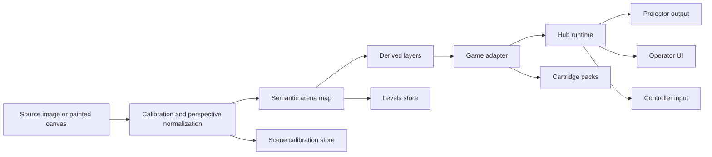
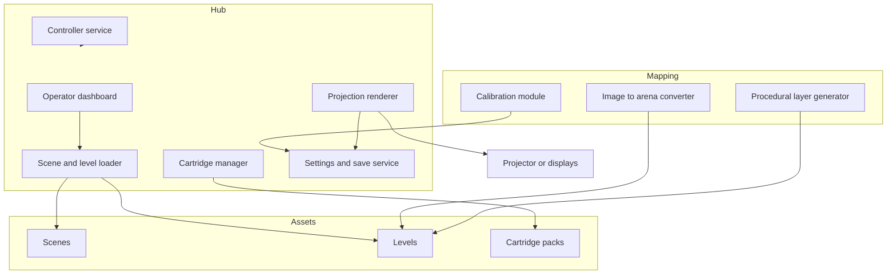
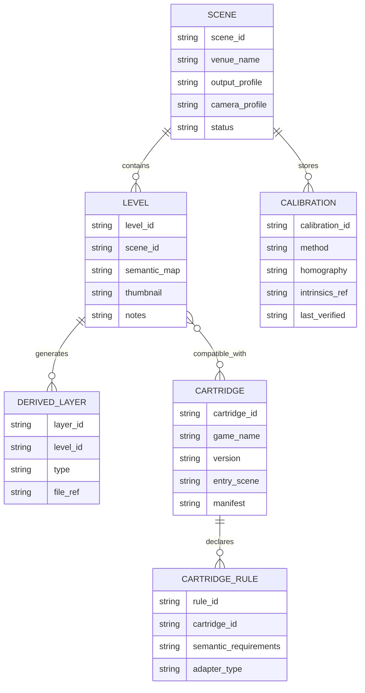
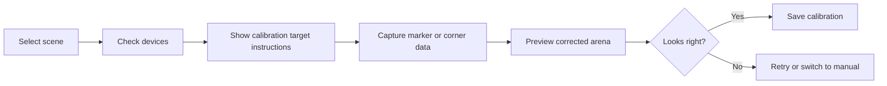
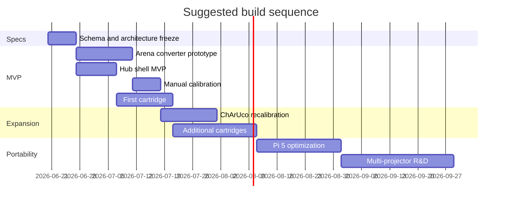

# Modular Projection Mapping Hub for Interactive Retro-Style Games

## Executive summary

The highest-leverage way to build this system is **not** to start with projector-specific “show a rectangle on the wall” logic. It is to build an **engine-agnostic semantic arena pipeline** first: a way to turn an image, painted canvas, or calibrated surface into a canonical “arena” representation that games can interpret in different ways. In practice, that means a base map format, a calibration transform, and a set of derived layers such as occupancy, surface tops, path graphs, checkpoints, and spawn zones. Once that exists, projection is just an output transform layered on top. This is the right order because planar homography, resource packaging, dynamic content loading, and controller support are already well-served by mature tooling in OpenCV and modern game runtimes. Godot is especially strong for the hub/runtime layer because it supports multi-window/full-screen workflows, broad controller support, export packaging, and runtime loading of additional resource packs; OpenCV is strong for calibration, marker detection, and perspective correction. citeturn6search1turn18search0turn15search1turn14search0turn4search2

For the **primary MVP** on a PC or laptop, the most robust architecture is a **Godot-based hub** with a small calibration/mapping module built around OpenCV, initially implemented as a companion R&D tool in Python or C++, then folded into the runtime once the data model stabilizes. Calibration should progress in three tiers: **manual four-point mapping** first, **camera-assisted ChArUco or ArUco board recalibration** second, and **structured-light / projector-camera auto-calibration** only after the rest of the system is stable. OpenCV explicitly supports camera calibration, homography, ArUco, ChArUco, and feature-matching-plus-homography workflows, while ChArUco is specifically recommended by OpenCV when high precision is needed for calibration. Brown’s projector-camera calibration work is a strong primary reference for later structured-light automation because it uses local homographies to estimate projector image coordinates with sub-pixel precision. citeturn6search0turn6search1turn5search0turn18search0turn23search1

For the **portable long-term target**, Raspberry Pi 5 is the sensible first Pi candidate, not Pi 4. Raspberry Pi 5 adds a faster Cortex-A76 CPU, newer GPU support, dual 4Kp60 display output, PCIe for faster storage options, and Raspberry Pi’s own recommendation for active cooling on performance-heavy workloads; Pi 4 remains viable for simpler 2D content and tooling, but it is a worse target for a modern hub with calibration, controller handling, and multiple display ambitions. On the projection side, **short-throw** is the best overall default for interactive floor/wall arenas because it reduces shadows and glare versus long-throw without taking on all the geometry sensitivity of ultra-short-throw. Epson’s own guidance notes that digital keystone correction reduces image size, and some ultra-short-throw models are highly sensitive to small physical movements, which is exactly the kind of venue friction your hub is trying to avoid. citeturn2search0turn2search2turn0search0turn3search0turn3search8turn3search11

The central design decision that will protect this project over time is to treat **Scene**, **Level**, and **Cartridge** as separate concerns. A **Scene** stores physical venue alignment and device calibration. A **Level** stores interchangeable remaps or content variants for that scene. A **Cartridge** stores game logic/assets and a manifest describing what semantic layers it can consume. If you do that, you can add or remove games without creating cross-game dependencies, you can revisit the same location and only recalibrate once, and you can keep the actual operator experience extremely simple. Godot’s runtime resource-pack loading is a particularly strong fit for this “cartridge-like” model. citeturn15search1turn14search0



## Assumptions and success criteria

The analysis below assumes a first-release system with one projector, one venue plane at a time, a Windows PC or laptop for MVP testing, and one or two consumer controllers. It also assumes that the projection target is *approximately planar* for the MVP; if you later move into multi-plane scenic projection or curved surfaces, the calibration problem becomes materially harder and may justify structured-light work sooner. The medium-term portable target is Raspberry Pi 5 with one projector; multiple projectors and multiple calibrated outputs are considered future-facing and should influence interfaces now, but not implementation order. Raspberry Pi 5 and Raspberry Pi 4 both expose dual micro-HDMI outputs; Pi 5 is the more appropriate performance target. Godot’s modern windowing APIs already expose screen count, current screen selection, and multi-window/full-screen behavior on Windows, macOS, and Linux, which is enough to justify designing the hub for multiple outputs even if you only ship one at first. citeturn2search2turn0search0turn16search2turn17search1turn17search3

The project should be considered successful at the MVP stage if it can meet five operator-facing goals:

| Goal | Target |
|---|---|
| First-time venue setup | under 15 minutes |
| Returning to a saved scene | under 2 minutes |
| Swap between levels in same scene | under 10 seconds |
| Launch a new game cartridge | under 5 seconds after selection |
| Stable frame rate on MVP laptop | 60 fps at target projector resolution |

For the first deployable version, those targets matter more than “perfect procedural adaptation.” The user value is novelty, fast reset, repeatability, and being able to show multiple interactive experiences in the same physical space.

## Architecture and stack choices

The strongest overall stack for this project is a **hybrid**: **Godot for the hub/runtime/operator UI**, **OpenCV for calibration and mapping**, and **file-based arena metadata** that stays independent from the renderer. This gives you a fast path to a polished operator experience while preserving the option to change runtime technology later if you need to optimize for Raspberry Pi. Godot supports wide controller coverage, and as of Godot 4.5 it relies on SDL 3 for controller support on Windows, macOS, and Linux, which is a practical advantage for a public-facing install. Godot also supports export packaging on Linux, multi-resolution display handling, multi-window/full-screen behavior, and runtime loading of `.pck` or `.zip` resource packs through `ProjectSettings.load_resource_pack()`. citeturn4search2turn10search9turn10search5turn15search1turn14search0

### Software stack comparison

| Stack | Strengths | Weaknesses | Best use here | Evidence |
|---|---|---|---|---|
| **Godot 4.x** | Mature 2D/UI workflow, export system, multi-window support, SDL-backed controller support, runtime pack loading | Computer-vision tooling is not built in; Pi workflow is less explicit than creative-coding frameworks | **Primary hub runtime and operator UI** | citeturn4search2turn10search5turn15search1turn14search0 |
| **OpenCV** | Camera calibration, homography, ArUco, ChArUco, feature matching, warping | Not a game/runtime framework | **Calibration, arena conversion, editor helpers** | citeturn6search0turn6search1turn5search0turn18search0turn9search1 |
| **Python + OpenCV + lightweight render/tooling** | Fastest R&D loop, easy scripting, strong profiling and packaging tools | Harder to keep kiosk-grade runtime discipline; more packaging drift over time | **Research tools, offline converters, internal editor prototypes** | citeturn13search0turn10search7 |
| **raylib** | Small, minimal, efficient, official site explicitly lists RPI support | You must build much more UI/editor infrastructure yourself | **Fallback/runtime optimization path for Pi-first version** | citeturn10search0 |
| **openFrameworks** | Good creative-coding ecosystem, OpenCV add-ons, historical Pi support | Official Pi setup page is serviceable but clearly dated to older Raspberry Pi OS generations | **Specialized experiments, not recommended as the main hub** | citeturn10search1 |

The practical implication is simple: **build the hub in Godot**, but define your **scene files, level files, and semantic map files in plain data formats** so the runtime could be swapped later if Pi optimization truly requires it.

### Recommended runtime architecture



This architecture makes the **mapping layer** a first-class subsystem instead of burying it inside any one game. That is exactly what your earlier design instinct was pushing toward, and it is the right instinct.

## Hardware and calibration strategy

### Projector options

| Projector class | Best fit | Operational upside | Operational downside | Recommendation |
|---|---|---|---|---|
| **Standard/long throw** | Large room, fixed installation, projector far from surface | Placement can be easier in some rooms | More shadows and glare for interactive floor/wall use | Avoid for the main portable kit unless venue geometry forces it. Epson describes long throw as typical for centrally installed projectors in larger rooms. citeturn3search0 |
| **Short throw** | Portable arena kits, floor/wall interaction, pop-up installs | Larger image at shorter distance; reduced shadows and eye glare | Still needs careful alignment | **Best default choice for MVP and portable kit**. Epson explicitly notes short-throw reduces shadows and glare while staying practical for closer placement. citeturn3search0 |
| **Ultra-short throw** | Very tight spaces, projector very close to surface | Minimizes shadows/glare even more | Small physical movement can heavily affect geometry; digital correction can become touchy | Good future option, but only after your scene-calibration UX is mature. Epson notes UST characteristics make the image highly affected by small movements. citeturn3search11 |

Two additional projector rules matter in practice. First, use **optical placement first**, software/projection mapping second, and **in-projector digital keystone last**. Epson’s documentation repeatedly notes that keystone correction shrinks the image and can interact with memory/geometry modes depending on the model. Second, if you ever rely on saved projector geometry memories, treat them as a convenience layer, not the source of truth; your hub’s scene calibration should remain authoritative. citeturn3search3turn3search4turn3search8

### Compute platform options

| Platform | Relevant strengths | Relevant limits | Fit for this project | Evidence |
|---|---|---|---|---|
| **Windows or Linux laptop/desktop** | Fast iteration, easy projector testing, strong Godot/OpenCV/dev-tool support | Less portable than Pi appliance | **Best MVP platform** | Godot export and display APIs are built for desktop workflows. citeturn0search4turn16search2turn17search1 |
| **Mini PC** | More appliance-like than laptop, better than Pi for x86 runtime parity | Extra deployment complexity compared with laptop | Good “site box” after MVP | Same desktop-side benefits as above. citeturn16search2turn17search1 |
| **Raspberry Pi 5** | Cortex-A76 @ 2.4GHz, Vulkan/OpenGL ES support, dual 4Kp60 output, PCIe option, stronger USB power with 5A supply | Requires active cooling for best performance; ARM deployment discipline matters | **Best future portable target** | citeturn2search0turn2search2 |
| **Raspberry Pi 4** | Dual 4K output, adequate for simpler 2D, mature ecosystem | Much less headroom for hub + CV + effects | Acceptable secondary target for lightweight builds only | citeturn0search0 |

A practical recommendation is to target **two hardware profiles** in your design docs from day one:

- **Profile L**: Laptop/desktop MVP, 720p–1080p output, relaxed shader/effect budget.
- **Profile P**: Pi 5 portable build, 720p-first, minimal post-processing, aggressive asset budgets, active cooling assumed.

### Controller options

| Controller class | Operational note | Best use | Evidence |
|---|---|---|---|
| **Xbox controller family** | XInput is still the lowest-friction path on Windows and supports up to four unique controllers; Microsoft support flows are straightforward on Windows 10/11 | **Best default for MVP on Windows** | citeturn4search0turn21search10 |
| **DualSense** | USB and Bluetooth both work on Windows PC; some features vary, and some haptics/mic/headset features depend on wired mode or game support | Excellent secondary option, especially if users already own them | citeturn20search0turn20search2 |
| **8BitDo retro-style controllers** | Strong physical and aesthetic fit for “retro homage” experiences; some models expose remappable buttons and retro-friendly ergonomics | Good brand-aligned option after basic controller QA is done | citeturn19search3turn4search7 |
| **Switch Pro-style controllers** | Comfortable and feature-rich, but broad PC behavior depends more on SDL/controller DB normalization than XInput assumptions | Fine if your runtime uses SDL-backed input normalization | citeturn19search0turn4search7 |

Because Godot 4.5+ uses SDL 3 for controller support on desktop platforms, the real recommendation is: **normalize your input at the engine level and avoid controller-specific gameplay assumptions**. That keeps your public deployment more resilient. citeturn4search2turn4search7

### Calibration methods comparison

| Method | What it gives you | Accuracy and robustness | Cost and complexity | Recommended phase | Evidence |
|---|---|---|---|---|---|
| **Manual four-point homography** | Perspective-correct mapping from canvas/scene corners to arena plane | Good enough for MVP on flat surfaces; depends on careful corner selection | Very low | **Phase one** | OpenCV treats homography as the planar transform relating two planes and uses it for perspective correction. citeturn6search1 |
| **Marker-based ArUco** | Detectable fiducials with IDs and pose estimation | Robust, fast, easy to print | Requires visible markers or boards | Phase two | citeturn5search0turn18search4 |
| **Marker-based ChArUco** | Marker IDs plus chessboard-style corner precision | Better for high-precision calibration; OpenCV explicitly says ChArUco is better than standard ArUco boards when high precision is necessary | Slightly more setup | **Best camera-assisted recalibration path** | citeturn18search0 |
| **AprilTag** | High-quality fiducial system with robust detection and low false positives | Very strong fiducial option; widely used in robotics | Separate detector/tooling choice | Good alternative if you prefer AprilTag ecosystem | citeturn8search0turn8search38 |
| **Markerless feature matching + homography** | Align known textured images to scene using features and RANSAC | Works only when the surface has sufficient texture and stable lighting | Moderate | Good for certain venue recall workflows, not all | citeturn9search1 |
| **Structured-light projector-camera calibration** | Projector intrinsics/extrinsics and more automated, often more accurate calibration | Highest ceiling; can achieve sub-pixel projector coordinate estimation | Highest complexity; setup overhead | **Late-stage R&D, not MVP** | citeturn23search1turn23search0 |

### Recommended calibration path

The right path is:

1. **Ship manual four-point scene setup first.**
2. **Add a camera-assisted ChArUco wizard next.**
3. **Only pursue structured light when you have evidence that venue setup time or multi-projector registration is the next bottleneck.**

That sequence keeps your problem small while leaving a credible upgrade path backed by primary literature and mature libraries. citeturn6search1turn18search0turn23search1

## Data model, saved projects, and semantic map design

The data model should deliberately separate **physical calibration**, **shared arena meaning**, and **game-specific interpretation**.

### Core entities

- A **Scene** is a physical venue profile: projector/display choice, calibration transform, optional camera parameters, controller defaults, and environmental notes.
- A **Level** is a content remap for a given scene: semantic masks, overlays, thumbnails, procedural settings, and derived geometry.
- A **Cartridge** is a packaged game bundle that declares what map semantics it understands.



### Why semantic maps beat per-game maps

If every game authors its own map format, you will save time once and then pay for it forever. If instead you define a **small semantic vocabulary** that every game can read from, then each game can adapt that shared map to its own mechanics. The semantic map should stay intentionally simple.

A strong first-pass palette is:

| Semantic class | Meaning |
|---|---|
| `0` empty | no gameplay surface |
| `1` solid | collision/filled region |
| `2` path | traversable lane / tunnel |
| `3` platform_top | intentional jumpable top edge |
| `4` hazard | damage or fail area |
| `5` spawn | player/enemy/item spawn |
| `6` goal | endpoint, checkpoint, finish |
| `7` pickup | collectible seed point |
| `8` decor_ignore | visible but ignored by gameplay |
| `9` ui_block` | do not project HUD-critical elements here |

That lets a Pac-Man-like adapter read `path`, a platformer adapter derive walkable top surfaces from `solid` and `platform_top`, and a racer adapter read `path` or `goal` to build loops and checkpoints. This keeps the shared authoring surface comparable to drawing in an indexed-color paint program, while still allowing procedural derivation.

### Recommended on-disk structure

```text
hub-project/
  app/
    hub-runtime/
    tools/
  content/
    scenes/
      scene_warehouse_floor/
        scene.yaml
        reference/
          arena_photo.jpg
          calibration_board_photo.jpg
        calibration/
          current.yaml
          history/
        levels/
          level_race_a/
            level.yaml
            semantic_map.png
            overlays/
              checkpoints.png
              safezones.png
            derived/
              occupancy.png
              navgraph.json
              platform_edges.json
            thumb.png
          level_maze_b/
            level.yaml
            semantic_map.png
            overlays/
            derived/
            thumb.png
    cartridges/
      paclike/
        manifest.yaml
        pack.pck
      racer/
        manifest.yaml
        pack.pck
      jumper/
        manifest.yaml
        pack.pck
  obsidian/
    10-research/
    20-architecture/
    30-tasks/
    40-agent-runs/
    50-schemas/
    60-bases/
    70-qa/
    80-builds/
```

### Scene and level file examples

A **scene** should own venue calibration:

```yaml
scene_id: scene_warehouse_floor
venue_name: Warehouse Floor
output_profile:
  display_index: 1
  native_resolution: [1280, 720]
  projector_class: short_throw
camera_profile:
  enabled: true
  calibration_file: calibration/camera_intrinsics.yaml
current_calibration:
  method: charuco
  file: calibration/current.yaml
controller_profile:
  default_type: xbox
  players: 2
notes:
  - Return venue.
  - Projector taped at ceiling mark B.
status: verified
```

A **level** should own content mapping:

```yaml
level_id: level_race_a
scene_id: scene_warehouse_floor
semantic_map: semantic_map.png
palette_schema: ../../../../obsidian/50-schemas/semantic-palette-v1.yaml
procedural:
  racer:
    centerline_mode: skeleton
    checkpoint_count: 8
  jumper:
    min_platform_width_px: 32
    underside_cull: true
derived:
  occupancy: derived/occupancy.png
  navgraph: derived/navgraph.json
  platform_edges: derived/platform_edges.json
thumbnail: thumb.png
status: playable
```

### Cartridge manifest example

```yaml
cartridge_id: racer
game_name: Neon Sprint
version: 0.3.0
engine: godot
entry_scene: res://games/racer/main.tscn
requires:
  semantic_classes: [path, hazard, spawn, goal]
  derived_layers: [navgraph]
compatibility:
  scene_schema: ">=1.0 <2.0"
  level_schema: ">=1.0 <2.0"
operator_flags:
  supports_2_players: true
  supports_touch_ui: false
```

### Procedural overlays versus custom per-game maps

This is where your instinct about “not spending too much time on site” matters most. The winning compromise is:

- Keep the **shared semantic map simple**.
- Allow each game to define **small procedural adapters**.
- Allow **manual overlay layers** only where procedural rules are not good enough.

That design keeps venue setup short without forcing every game into awkward one-size-fits-all geometry.

A useful rule is:

- If a transformation can be recomputed from the semantic map in less than a second and is stable, it belongs in a **procedural adapter**.
- If the transformation changes creative intent or requires subjective judgment, it belongs in a **manual overlay**.

For example:

| Game style | Prefer procedural | Prefer manual |
|---|---|---|
| Maze/patrol game | path graph extraction, connected components | bespoke one-way gates, secret tunnels |
| Platformer | top-edge extraction, width filtering, underside culling | hand-authored hero routes, exact collectible placement |
| Racer | lane skeletonization, checkpoint distribution | dramatic shortcuts, scenic set pieces |

### A critical non-technical risk you should plan for

If you lean too hard into original game branding, names, logos, or copied artwork, you create avoidable intellectual-property risk. The U.S. Copyright Office states that a game’s idea and methods of play are not protected by copyright in the same way as original expressive artwork and text, while the USPTO explains that trademarks protect names, symbols, and source-identifying branding. The safest path is therefore: **borrow gameplay patterns, not trademarked names/logos or copied art assets**, unless you are licensed to use them. This strongly favors a “homage” visual strategy with your own hub branding and selectively nostalgic color/motion cues. citeturn22search4turn22search10turn22search1turn22search6

## Agent orchestration, Obsidian workflow, and operator UX

### Why Obsidian is a good control plane

Obsidian Bases is a particularly good fit for this project because it provides **database-like views over local Markdown files and properties**, with `.base` files describing views, filters, and formulas while leaving the underlying work items in human-readable notes. Obsidian Properties are YAML-backed structured metadata at the top of each note, which makes them easy for both humans and agents to update. For an agentic workflow, that is significantly safer than forcing many agents to mutate a shared binary database file. citeturn11search2turn11search1turn11search0

### Recommended Obsidian folder and database schema

The **vault should be the source of truth for planning**, not the runtime. Keep runtime content under `content/`, and use Obsidian for orchestration, specs, logs, and QA.

```text
obsidian/
  10-research/
    papers/
    calibration/
    hardware/
  20-architecture/
    hub-architecture.md
    map-schema.md
    cartridge-spec.md
  30-tasks/
    TASK-map-schema-v1.md
    TASK-charuco-wizard-prototype.md
    TASK-godot-hub-shell.md
  35-locks/
    LOCK-content-scenes-scene_warehouse_floor.md
    LOCK-obsidian-20-architecture-map-schema.md
  40-agent-runs/
    RUN-2026-06-19-highplanner-a.md
    RUN-2026-06-19-lowworker-c.md
  50-schemas/
    semantic-palette-v1.yaml
    scene-schema-v1.yaml
    level-schema-v1.yaml
  60-bases/
    tasks.base
    experiments.base
  70-qa/
    qa-mvp-checklist.md
    venue-acceptance-script.md
  80-builds/
    build-notes-mvp.md
```

### Conflict avoidance strategy for agents

The core rule should be: **one agent, one task note, one artifact directory, one lock file per touched shared resource**.

This is the minimal protocol that scales:

1. A **high-powered planner agent** creates or refines a task note with complete acceptance criteria.
2. A **worker agent** claims the task by updating only that task note and creating lock notes for shared resources.
3. The worker writes artifacts only into its assigned output folder.
4. Shared architecture docs are updated only through pre-declared `BEGIN GENERATED` / `END GENERATED` sections or through a dedicated integrator agent.
5. Every task finishes with a QA result note and artifact manifest.

That avoids the classic multi-agent problem where several workers all mutate the same summary document or schema file at once.

### Example task template

```markdown
---
task_id: TASK-charuco-wizard-prototype
title: ChArUco recalibration wizard prototype
status: ready
priority: high
owner_agent: null
model_tier: low
depends_on:
  - TASK-map-schema-v1
touches:
  - content/scenes
  - app/tools
  - obsidian/20-architecture
locks_required:
  - content-scenes
acceptance:
  - Wizard captures 5+ valid ChArUco frames
  - Stores scene homography to calibration/current.yaml
  - Produces before/after preview image
artifacts_expected:
  - app/tools/charuco_wizard/
  - content/scenes/*/calibration/current.yaml
  - obsidian/40-agent-runs/*
---

## Context

Implement a venue-side recalibration wizard for existing scenes.

## Constraints

- No breaking changes to scene schema v1.
- Must run on laptop webcam and USB camera.
- Save failures must be non-destructive.

## Steps

- Detect ChArUco board.
- Estimate camera pose / homography.
- Preview corrected arena.
- Save only after operator confirmation.

## QA notes

TBD
```

### Example lock template

```markdown
---
lock_id: LOCK-content-scenes
resource: content/scenes
owner_agent: lowworker-c
task_id: TASK-charuco-wizard-prototype
created_at: 2026-06-19T10:12:00-07:00
status: active
---
```

### Example Obsidian Base

Obsidian Bases stores views in `.base` files and can filter notes by folder and property values. A task database can therefore be built without moving away from Markdown. citeturn11search1turn11search2

```yaml
filters:
  and:
    - file.inFolder("30-tasks")
views:
  - type: table
    name: Ready work
    filters:
      and:
        - 'status == "ready"'
    order:
      - priority
      - file.name
  - type: table
    name: In progress
    filters:
      and:
        - 'status == "in_progress"'
    order:
      - owner_agent
      - file.name
```

### High-powered versus low-powered agent roles

| Agent type | Best responsibilities |
|---|---|
| **Planner / architect** | break work into tasks, define schemas, acceptance criteria, sequencing, integration plan |
| **Research agent** | source comparison, calibration literature review, hardware recommendations, citation updates |
| **Prototype worker** | build isolated tools, converters, UI mockups, game adapters |
| **Integrator** | merge accepted artifacts, update runtime manifest, regenerate docs sections |
| **QA agent** | run smoke tests, compare golden outputs, verify schema and performance claims |

The simplest approach is to give low-powered agents **closed-world tasks**: specific file paths, fixed output names, and explicit acceptance tests. That is much more reliable than asking them to “improve the system.”

### Operator UX for non-technical users

The operator-facing hub should look and behave like a kiosk, not a game engine editor.

A good main navigation model is:

- **Scenes**
- **Levels**
- **Play**
- **Calibrate**
- **Devices**
- **Service**

The most important operator affordances are:

- a **saved scenes gallery** with thumbnails,
- a **level swiper** within a selected scene,
- a **recalibration wizard**,
- a **test pattern** button,
- a **controller test** screen,
- a **panic black / blank output** button,
- a **last-known-good restore** action.

### Example dashboard wireframe

```text
┌─────────────────────────────────────────────────────────────────────┐
│ HUB                             Venue: Warehouse Floor             │
├─────────────────────────────────────────────────────────────────────┤
│ Scenes | Levels | Play | Calibrate | Devices | Service            │
├─────────────────────────────────────────────────────────────────────┤
│ Saved scenes                                                       │
│ [ Warehouse Floor ] [ Gym Court ] [ Garage ] [ New Scene + ]      │
├─────────────────────────────────────────────────────────────────────┤
│ Levels for Warehouse Floor                                         │
│ ◀ [ Race A ] [ Maze B ] [ Jumper C ] [ Demo D ] ▶                 │
├─────────────────────────────────────────────────────────────────────┤
│ Current calibration                                                │
│ Status: VERIFIED        Method: ChArUco        Last check: Today   │
│ [Preview] [Recalibrate] [Show Test Pattern] [Blank Output]         │
├─────────────────────────────────────────────────────────────────────┤
│ Devices                                                            │
│ Projector: HDMI-1    Camera: USB Cam    Controllers: 2 connected   │
│ [Controller Test] [Display Test] [Input Latency Test]              │
├─────────────────────────────────────────────────────────────────────┤
│ [ Launch Selected Level ]                                          │
└─────────────────────────────────────────────────────────────────────┘
```

### Recalibration wizard flow

The recalibration wizard should be guided and finite:



This gives non-technical operators a safe fallback: if camera-assisted calibration fails, they can still do a manual corner adjustment.

## Performance targets, deployment, testing, and roadmap

### Performance targets

These are engineering targets rather than guarantees, but they are realistic and should drive early profiling.

| Profile | Resolution target | Frame target | Notes |
|---|---|---|---|
| **Laptop MVP** | 1280×720 or 1920×1080 | 60 fps | Preferred development and venue test profile |
| **Pi 5 portable** | 1280×720 first | 60 fps for simple 2D hub and light effects | Use active cooling; limit post-processing |
| **Pi 4 fallback** | 1280×720 | 30–60 fps depending on game complexity | Reserve for lighter builds only |

Profiling should happen at three levels:

- **Engine frame profiling** with the Godot profiler, which is designed to help isolate script, rendering, and scene costs. citeturn12search6turn12search13
- **Offline tool profiling** with Python `cProfile` and `pstats` if Python is used for calibration/editor R&D. citeturn13search0turn13search4
- **Venue metrics** including startup time, recalibration time, scene reload time, and controller-to-response latency measured by test routines.

### Packaging and deployment

Godot’s packaging model is unusually well aligned with your “cartridge” idea. Exported projects already split executable/runtime concerns from data, and Godot explicitly supports creating `.pck` packages at build time and loading `.pck` or `.zip` packs into `res://` at runtime using `ProjectSettings.load_resource_pack()`. Godot also supports project settings overrides through `override.cfg`, including in exported projects when the file is placed next to the binary. That gives you a clean deployment model:

- **Base hub export** = stable executable.
- **Cartridge packs** = separate `.pck` bundles dropped into a `cartridges/` folder.
- **Venue overrides** = site-specific `override.cfg` and/or scene files on external storage. citeturn14search0turn15search1turn15search7

Recommended deployment layout:

```text
deploy/
  hub.exe or hub.x86_64
  data.pck
  override.cfg
  scenes/
  cartridges/
    racer.pack.pck
    jumper.pack.pck
    maze.pack.pck
  logs/
```

If you keep a Python-based calibration tool during development or early deployment, package it separately with PyInstaller rather than baking Python into the main hub runtime. PyInstaller’s current documentation explicitly supports building standalone executables across major desktop OSes. citeturn10search7

### Testing and QA plan

The QA plan should have four layers.

**Schema QA**  
Validate every `scene.yaml`, `level.yaml`, and `manifest.yaml` against versioned schemas. Fail CI if a field is missing or a semantic class is undefined.

**Mapping QA**  
Use golden-image tests for:
- homography correction,
- semantic palette conversion,
- derived occupancy,
- navgraph extraction,
- platform edge derivation.

**Runtime QA**  
For every cartridge:
- launch test,
- scene load,
- controller detection,
- level switch,
- resource-pack load/unload,
- panic blank output,
- recover last-known-good scene.

**Venue QA**  
Create one repeatable on-site acceptance script:
1. Power on.
2. Load saved scene.
3. Verify output alignment.
4. Recalibrate.
5. Launch three different games.
6. Switch controllers.
7. Power cycle and restore.

### Step-by-step pipeline from MVP to full system

| Milestone | Deliverables | Estimated effort |
|---|---|---|
| **Research and specification** | scene/level/cartridge schemas, hardware shortlist, calibration decision doc | 1 week |
| **Arena pipeline prototype** | image-to-arena converter, semantic palette v1, derived-layer generator | 2–3 weeks |
| **Hub shell MVP** | Godot launcher UI, scenes gallery, level swiper, controller test page | 2 weeks |
| **Manual calibration MVP** | four-point mapping tool, scene save/load, test pattern | 1–2 weeks |
| **First cartridge integration** | one complete game using semantic map adapters | 2 weeks |
| **Camera-assisted recalibration** | ChArUco wizard, preview/save flow, scene verification | 2 weeks |
| **Multi-game content pass** | two to four more games, cartridge manifests, compatibility checks | 3–4 weeks |
| **Portable profile pass** | Pi 5 optimization, thermal tests, simplified visual settings | 2–4 weeks |
| **Multi-projector R&D** | output abstraction, per-output calibration, sync experiments | 4+ weeks |

Assuming one lead developer plus agents running in parallel, the most important sequencing rule is: **freeze the map schema early**, because almost every other task depends on it.

### Suggested timeline



### Hypotheses and open questions to probe with agents

| Hypothesis / question | Why it matters | How to test |
|---|---|---|
| **Indexed semantic PNG + overlays is faster than per-game map authoring** | Core foundation decision | Time 3 games authored from one shared scene |
| **ChArUco saves more operator time than it costs to set up camera workflow** | Justifies the second-phase calibration investment | Compare manual reload vs ChArUco reload across 5 venue resets |
| **Pi 5 can sustain 720p60 for hub + simple 2D cartridges** | Determines portable target viability | Profiling pass with real projector connected |
| **Procedural adapters handle at least 70% of remapping needs** | Decides how much manual level authoring you will tolerate | Build racer, maze, platformer from same scene |
| **Short-throw beats UST for real venue friction** | Hardware buying decision | Measure total setup time, not just image shape quality |
| **Godot hub + OpenCV tools is more stable than Python-only runtime** | Long-term maintainability | Compare crash rate, startup time, deployment diff count |

### Major pitfalls and mitigation strategies

| Pitfall | Why it is dangerous | Mitigation |
|---|---|---|
| Starting with projector mapping instead of map semantics | Locks you into venue-specific work and slows every new game | Build semantic arena pipeline first |
| Overusing in-projector keystone | Can shrink image and create additional geometry dependence | Prefer physical placement + software mapping; use projector keystone sparingly citeturn3search3turn3search4 |
| Going too procedural too early | Creates brittle outputs that look “almost right” but need manual rescue | Use procedural adapters plus manual overlays as a hybrid |
| Letting many agents edit shared docs | Creates merge corruption and inconsistent specs | Use one-task-per-note and lock files |
| Building runtime and authoring tools in one codebase too early | Slows experimentation and makes deployment fragile | Keep R&D tools separate until schemas settle |
| Assuming Pi 4 and Pi 5 are equivalent targets | They are not, especially for headroom and cooling | Treat Pi 5 as the real portable target citeturn2search0turn2search2turn0search0 |
| Copying famous game branding/art too directly | Avoidable IP exposure | Use homage gameplay, original branding, original art direction citeturn22search4turn22search1 |

### Recommendations

The most defensible front-to-back plan is:

1. **Adopt Godot as the hub runtime** and **OpenCV as the calibration/mapping subsystem**.
2. **Define a semantic arena schema before building more games**.
3. **Implement Scene / Level / Cartridge separation immediately**.
4. **Start calibration with manual four-point mapping**, then add **ChArUco**.
5. **Use short-throw projection for the main kit**.
6. **Treat Raspberry Pi 5 as the first serious portable target**.
7. **Use Obsidian Markdown + Bases for orchestration, not for runtime state**.
8. **Package games as cartridge-style resource packs** from the start.
9. **Keep nostalgia in mechanics and motion language, not in copied IP**.

### Prioritized next-step checklist for agent tasks

- **Planner agent**
  - Write `scene-schema-v1`, `level-schema-v1`, and `cartridge-schema-v1`.
  - Define semantic palette v1 and compatibility rules.
  - Freeze folder conventions and lock protocol.

- **Research agent**
  - Produce a short-throw projector shortlist by venue size and brightness class.
  - Produce a Pi 5 versus laptop profiling plan.
  - Gather ChArUco board print specs and camera setup recommendations.

- **Prototype agent**
  - Build an image-to-semantic-map prototype with threshold, posterize, paint, and palette assignment tools.
  - Build a manual four-corner mapping prototype.
  - Build a derived-layer prototype for occupancy, navgraph, and top-edge extraction.

- **Hub agent**
  - Build the Godot shell with:
    - scenes gallery,
    - levels swiper,
    - controller test page,
    - test pattern page,
    - blank-output button.
  - Implement runtime scanning of `scenes/` and `cartridges/`.

- **Calibration agent**
  - Build a ChArUco recalibration wizard with preview and save-confirm flow.
  - Persist calibration history per scene.

- **Game adapter agents**
  - Implement one maze adapter, one platform adapter, and one racer adapter against the same semantic schema.
  - Record where procedural adaptation fails and requires overlays.

- **QA agent**
  - Create golden tests for homography and derived layers.
  - Create a venue acceptance script and smoke test runbook.
  - Define performance budgets for Profile L and Profile P.

- **Deployment agent**
  - Package one cartridge via `.pck`.
  - Add runtime `load_resource_pack()` support.
  - Test external scene/cartridge storage and `override.cfg` venue override flow. citeturn14search0turn15search1turn15search7