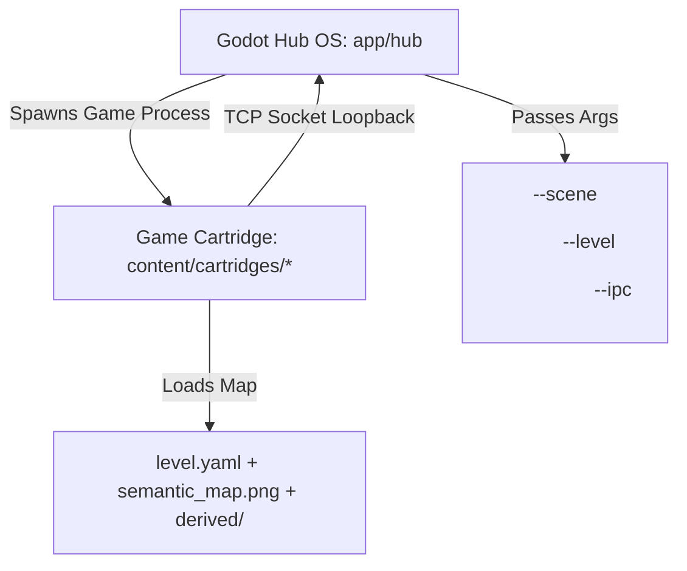

# KE_ArKade — System State & Orchestrator Brief

This brief summarizes the current state of **KE_ArKade**, architectural layers, bugs resolved, and raises a key design decision regarding **Vector vs. Grid/Cell-Based** map generation.

---

## 1. Project Architecture & State
The platform enforces a strict separation of concerns to allow project projection mapping onto physical shapes (e.g., climbing walls):



### Key Platforms & Modules:
- **Kiosk Hub (`app/hub/`)**: A Godot 4 interface that scans physical scenes (`content/scenes/`) and their semantic levels (`levels/`), letting users choose game cartridges. Handles child-process lifecycle, NDJSON IPC protocol, and auto-restore crash recovery.
- **Level Authoring Tool (`app/tools/level_authoring/`)**: A Python/Tkinter GUI that lets users paint semantic classes (`solid`, `path`, `spawn`, `goal`, etc.) over a background photo of a physical venue, producing `semantic_map.png` and auto-compiling derived layers.
- **Game Cartridges (`content/cartridges/`)**:
  - **Pac-Man** (`pacman`): Path-graph node follower with a classic blue corridor vs. neon skin toggle (`F2`) and reference photo background toggle (`F1`).
  - **Tetris** (`tetris`): Polygon-bounded collision well supporting 1-4 players.
  - **Frogger** (`robo_frogger`), **Super Sprint** (`trace`), and **Bomberman** (`bomberman`) stubs.

---

## 2. Critical Bugs Resolved in This Turn

We resolved three major blockers that were causing the game window to display a gray screen, crash, or enter an infinite flashing loop:

1. **Godot Hub Centering Bug**:
   - *Issue*: The cartridge selection dialog was rendered offset in the bottom-right quadrant of the screen.
   - *Fix*: Dynamic control nodes grow down-right by default in Godot. We wrapped the dialog in a parent `CenterContainer` within [main.gd](file:///c:/Users/Kons/Documents/_KE_VibeApps/KE_ArKade/app/hub/main.gd) to guarantee perfect, resolution-independent centering.
2. **Premature Heartbeat Timeout & Flashing Loop**:
   - *Issue*: Loading custom background textures took longer than 3 seconds. The Hub's launcher checked for heartbeats *before* the game had fully initialized and connected, force-killing it and triggering auto-restore in an infinite loop.
   - *Fix*: Modified [launcher.gd](file:///c:/Users/Kons/Documents/_KE_VibeApps/KE_ArKade/app/hub/launcher/launcher.gd) to only check missed heartbeats after the TCP connection (`peer`) is active, resetting timers on connection, and using a separate 10-second startup connection timeout.
3. **Tetris Joystick Script Parse Error**:
   - *Issue*: `tetris/main.gd` called `Input.is_joy_button_just_pressed()`, which does not exist in Godot 4, causing compile abort.
   - *Fix*: Added a custom `is_joy_button_just_pressed()` state tracker in [main.gd (Tetris)](file:///c:/Users/Kons/Documents/_KE_VibeApps/KE_ArKade/content/cartridges/tetris/main.gd).
4. **Stray Custom Level Location**:
   - *Issue*: The authoring tool saved custom files directly in `levels/` instead of a subdirectory, causing the Hub to parse the `derived` folder as a separate level.
   - *Fix*: Migrated the custom climbing wall level files to the [demo_level](file:///c:/Users/Kons/Documents/_KE_VibeApps/KE_ArKade/content/scenes/scene_demo_wall/levels/demo_level/) folder.

---

## 3. Conceptual Design Escalation: Vector vs. Grid/Cell-Based

The current implementation represents physical spaces using **freeform vectors**:
- Paths are skeletonized into mathematical coordinate graphs (`navgraph.json` with floating-point `x`/`y` nodes).
- Boundaries are arbitrary polygon colliders (`container.json` coordinates).

While this works for projection alignment, it complicates games designed for discrete **cell-grids** (e.g. 8-bit games where Pac-Man, ghosts, and Tetris blocks live on a grid). 

### The Question:
Should games rasterize/pixelate the vector map into a discrete 8-bit grid, or should the compiler generate a grid representation?

```
Current (Vector):       [Node 1] --(Vector Line)--> [Node 2]
Classic (8-Bit Grid):   [Wall][Path][Path][Dot][Ghost][Wall]
```

### Proposed Solutions:

#### Option A: Game-Side Grid Rasterization ( Snapping )
* **How**: The game cartridge takes the bounding polygon or path graph, overlays a configurable 2D grid matrix (e.g., 32x32px cells), and rasterizes it into a discrete array of grid cells.
* **Pros**: Keeps the level format simple and vector-based.
* **Cons**: Each game has to write its own rasterization logic, leading to duplicate calculations and potential bugs (e.g., paths not aligning to cells).

#### Option B: Compiler-Side Grid Export ( Gridify )
* **How**: The Python compiler tool (`app/tools/arena_compiler/`) generates a `grid.json` layer alongside `navgraph.json`. It maps the `semantic_map.png` into a cell matrix (e.g., a 2D array representing tiles: Wall, Path, Empty, Spawn).
* **Pros**: Extremely easy for cartridges to load and draw. Guarantees that the visual pixelation/grid alignment matches the physics perfectly. Makes writing games much closer to classic 8-bit cell engines.
* **Cons**: The grid cell size must be configured per cartridge or level.

---

## 4. Immediate Access Links for Orchestrator Review
- Hub Script: [main.gd](file:///c:/Users/Kons/Documents/_KE_VibeApps/KE_ArKade/app/hub/main.gd)
- Launcher: [launcher.gd](file:///c:/Users/Kons/Documents/_KE_VibeApps/KE_ArKade/app/hub/launcher/launcher.gd)
- Tetris Script: [main.gd (Tetris)](file:///c:/Users/Kons/Documents/_KE_VibeApps/KE_ArKade/content/cartridges/tetris/main.gd)
- Custom Map Level: [demo_level/level.yaml](file:///c:/Users/Kons/Documents/_KE_VibeApps/KE_ArKade/content/scenes/scene_demo_wall/levels/demo_level/level.yaml)
